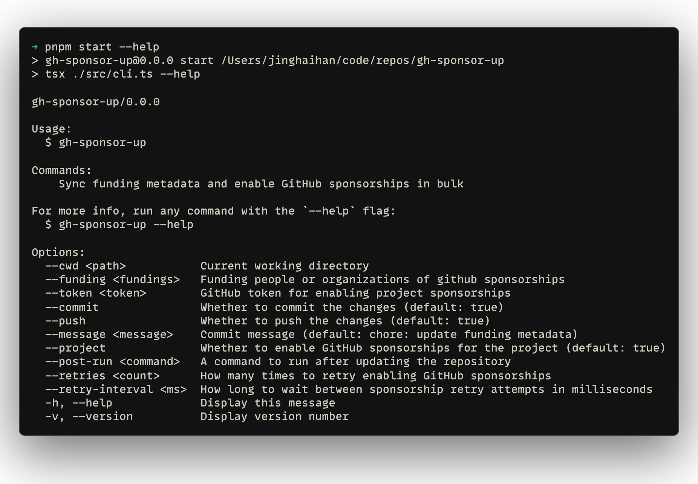

# gh-sponsor-up

[![npm version][npm-version-src]][npm-version-href]
[![bundle][bundle-src]][bundle-href]
[![JSDocs][jsdocs-src]][jsdocs-href]
[![License][license-src]][license-href]

Sync funding metadata across local repositories and enable GitHub project sponsorships in bulk.

```sh
npx gh-sponsor-up --cwd ~/code/repos --funding jinghaihan --token $GH_TOKEN
```

<p align='center'>

</p>

## Feature

This CLI can:

- update `package.json` funding
- create `.github/FUNDING.yml`
- run a post command in each repository
- commit and push changes
- enable GitHub project sponsorships with retries

## Configuration

You can use CLI flags or a `gh-sponsor-up.config.ts` file:

```ts
import { defineConfig } from 'gh-sponsor-up'

export default defineConfig({
  funding: 'jinghaihan',
  retries: 5,
  retryInterval: 120000,
})
```

## License

[MIT](./LICENSE) License © [jinghaihan](https://github.com/jinghaihan)

<!-- Badges -->

[npm-version-src]: https://img.shields.io/npm/v/gh-sponsor-up?style=flat&colorA=080f12&colorB=1fa669
[npm-version-href]: https://npmjs.com/package/gh-sponsor-up
[npm-downloads-src]: https://img.shields.io/npm/dm/gh-sponsor-up?style=flat&colorA=080f12&colorB=1fa669
[npm-downloads-href]: https://npmjs.com/package/gh-sponsor-up
[bundle-src]: https://img.shields.io/bundlephobia/minzip/gh-sponsor-up?style=flat&colorA=080f12&colorB=1fa669&label=minzip
[bundle-href]: https://bundlephobia.com/result?p=gh-sponsor-up
[license-src]: https://img.shields.io/badge/license-MIT-blue.svg?style=flat&colorA=080f12&colorB=1fa669
[license-href]: https://github.com/jinghaihan/gh-sponsor-up/LICENSE
[jsdocs-src]: https://img.shields.io/badge/jsdocs-reference-080f12?style=flat&colorA=080f12&colorB=1fa669
[jsdocs-href]: https://www.jsdocs.io/package/gh-sponsor-up
